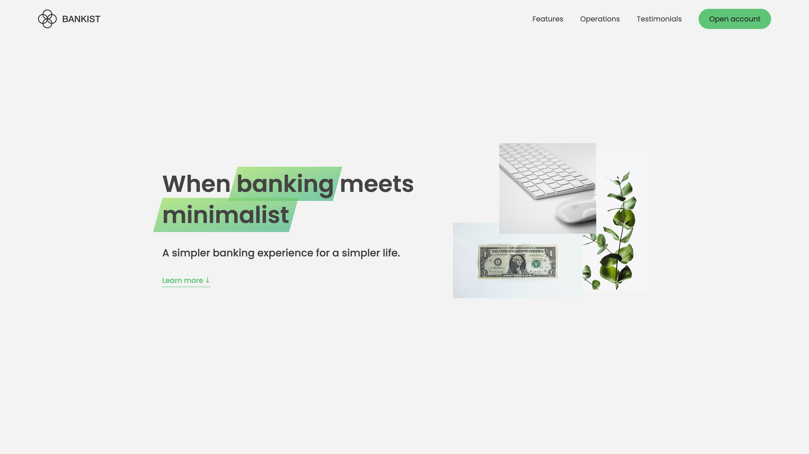

# 🏦 Bankist App – Minimalist Banking Website


(screenshots/2.png)
(screenshots/3.png)
(screenshots/4.png)
(screenshots/5.png)
(screenshots/6.png)
(screenshots/full.png)

## 🚀 Overview

A sleek, minimalist banking website crafted with **Vanilla JavaScript (ES6+)** to showcase advanced object-oriented programming (OOP), DOM manipulation, and UI interactivity. Part of my JavaScript journey, this project highlights my ability to write **clean, reusable, and scalable code** without relying on frameworks—proving my front-end prowess in its purest form!

---

## 🌟 Features

- 🔐 **Modal Windows**: Interactive login/open account modals with smooth transitions.
- 📜 **Smooth Scrolling**: Native, modern scrolling triggered by buttons and navigation.
- 🌐 **Page Navigation with Event Delegation**: Efficient event handling via bubbling.
- 🗂️ **Tabbed Components**: Seamless switching between banking operations.
- 🌫️ **Sticky Navigation Bar**: Powered by the Intersection Observer API.
- 👀 **Reveal on Scroll Animations**: Sections animate into view with flair.
- 🖼️ **Lazy Loading Images**: Optimized rendering for top-tier performance.
- 🎞️ **Slider/Carousel**: Interactive with arrows, dots, and keyboard navigation.
- ⚡ **Optimized DOM Handling**: Event delegation, bubbling, capturing, and lifecycle management.

---

## 🛠️ Tech Stack

- **JavaScript (ES6+)**: OOP-driven, modular structure.
- **HTML5 & CSS3**: Semantic markup and modern styling.
- **Intersection Observer API**: Enables scroll animations, sticky nav, and lazy loading.
- **100% Vanilla JS**: No frameworks, no libraries—just raw skill!

---

## 📂 Project Structure

```
bankist-app/
├── index.html
├── css/
│   └── style.css
├── js/
│   └── script.js    # Main logic
├── imgs/
│   └── jpgs     # all the image sources used in this project.
└── README.md
```

---

## 🎓 Learning Outcomes

This project demonstrates:

- Mastery of **DOM traversal**, **event propagation**, and **delegation**.
- Utilization of modern ES6+ features: `forEach`, `bind`, `const/let`, arrow functions, destructuring.
- A **clean architecture** emphasizing OOP principles.
- Performance optimization with **lazy loading** and minimized repaint/reflow.
- Crafting **realistic UI interactivity** sans external libraries.

---

## 🏆 Why This Project Matters

The Bankist App transcends a learning exercise—it’s a **portfolio masterpiece** showcasing my front-end engineering strength. It proves I can:

- Build **feature-rich web applications** from scratch.
- Apply **best practices** in code structure and maintainability.
- Deliver **highly interactive, optimized user experiences**.

---

## 🔑 Run Locally

1. **Clone the Repo**:

   ```
   git clone https://github.com/sheharyarr-ahmed/Bankist-Website.git
   ```

2. **Open in Browser**:
   - Launch `index.html` in any modern browser.
   - Explore the live magic—no setup required!

---
